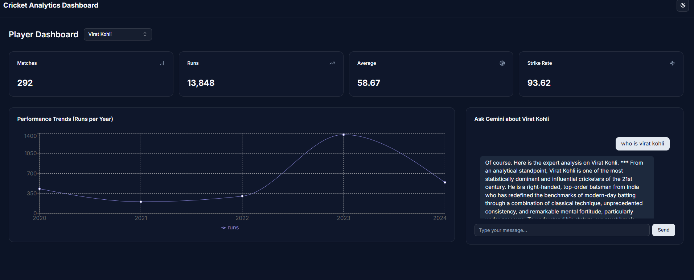
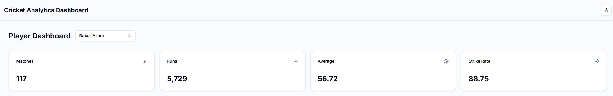
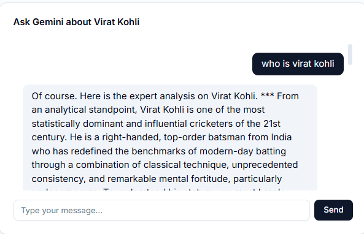
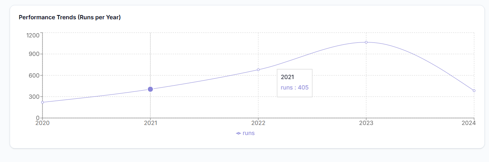
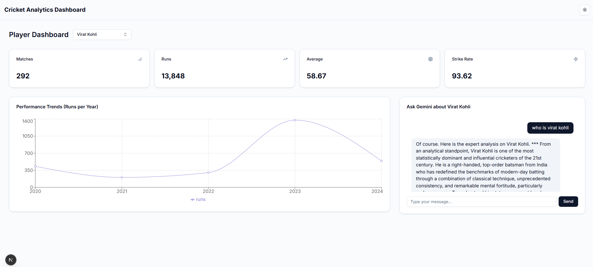

# Modern Cricket Analytics Dashboard



A fully interactive, modern web application for visualizing and analyzing cricket player statistics. This dashboard is built with Next.js and features dynamic charts, a responsive design, and an integrated AI chatbot powered by the Google Gemini API to answer player-related queries.

**Live Demo:** [**Add Your Deployed Vercel Link Here!**]

---

## Core Features

This dashboard is packed with features designed for a rich, interactive user experience.

| Feature                 | Description                                                                                             | Screenshot                                        |
| ----------------------- | ------------------------------------------------------------------------------------------------------- | ------------------------------------------------- |
| **At-a-Glance Stats**   | View key career statistics like Matches, Runs, Average, and Strike Rate that update instantly.            |           |
| **AI-Powered Analyst**  | Ask any question about the selected player and get real-time, data-driven insights from the Gemini API.   |         |
| **Performance Trends**  | Visualize a player's year-on-year performance with an animated, responsive line chart.                  |    |
| **Light & Dark Mode**   | A stunning UI that looks great in both light and dark modes, built with Tailwind CSS and shadcn/ui.       |  |
| **Dynamic Player Search**| Easily search and select from a list of top cricket players with a modern autocomplete dropdown.        |                                                   |
| **Smooth Animations**   | Fluid animations and transitions powered by Framer Motion provide an enhanced, modern user experience.  |                                                   |
| **Responsive Design**   | The layout is fully responsive, ensuring a seamless experience on all devices, from mobile to desktop.    |                                                   |

---

## Tech Stack

This project leverages a modern, full-stack tech stack to deliver a high-performance, visually appealing application.

-   **Framework**: [Next.js](https://nextjs.org/) (App Router)
-   **Language**: [TypeScript](https://www.typescriptlang.org/)
-   **AI Integration**: [Google Gemini API](https://ai.google.dev/)
-   **UI Components**: [shadcn/ui](https://ui.shadcn.com/) & [Radix UI](https://www.radix-ui.com/)
-   **Styling**: [Tailwind CSS](https://tailwindcss.com/)
-   **Data Visualization**: [Recharts](https://recharts.org/)
-   **Animations**: [Framer Motion](https://www.framer.com/motion/)
-   **Notifications**: [Sonner](https://sonner.emilkowal.ski/)

---

## Getting Started

Follow these instructions to get a copy of the project up and running on your local machine.

### Prerequisites

-   [Node.js](https://nodejs.org/) (v18.0 or later recommended)
-   npm, yarn, or your favorite package manager

### Installation & Setup

1.  **Clone the repository:**
    ```bash
    git clone https://github.com/YOUR_USERNAME/YOUR_REPO_NAME.git
    cd YOUR_REPO_NAME
    ```

2.  **Install dependencies:**
    ```bash
    npm install
    ```

3.  **Set up environment variables:**
    Create a file named `.env.local` in the root of your project. You will need to add your Google Gemini API key, which you can get for free from [Google AI Studio](https://aistudio.google.com/app/apikey).

    ```env
    # .env.local
    GEMINI_API_KEY="YOUR_GEMINI_API_KEY_HERE"
    ```
    **Important**: The `.env.local` file is listed in `.gitignore` and should never be committed to your repository.

4.  **Run the development server:**
    ```bash
    npm run dev
    ```

Open [http://localhost:3000](http://localhost:3000) with your browser to see the result.

---

## Deployment on Vercel

The easiest way to deploy your Next.js app is to use the [Vercel Platform](https://vercel.com/new). Follow the steps in the guide below.

[**Click here for the detailed Vercel Deployment Guide**](#hosting-on-vercel)

---

## Project Structure

-   **/app**: Contains all routes, pages, and core application logic.
    -   **/api/chat**: The backend API route for handling requests to the Gemini API.
    -   **/components**: All custom React components (`Chatbot`, `PlayerSearch`, `StatCard`, etc.).
        -   **/ui**: Auto-generated components from shadcn/ui.
    -   **page.tsx**: The main entry point and dashboard page.
-   **/lib**: Utility functions.
-   **/public**: Static assets like your screenshots.